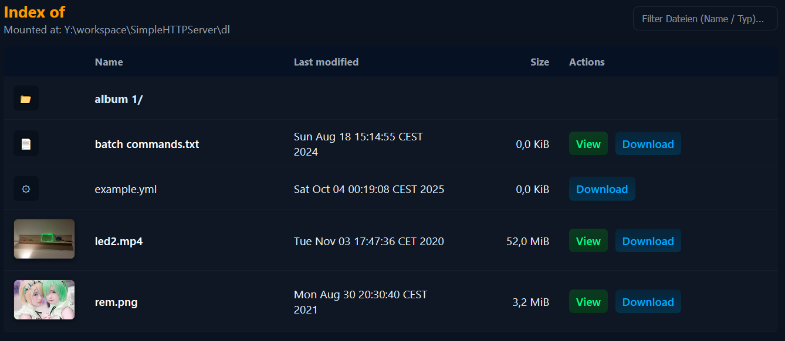

### SimpleHTTPServer

This project is a lightweight HTTP server implemented in Java 8 using Eclipse IDE. It allows users to easily share and transfer files over a Local Area Network (LAN) between computers.

#### Key Features:
- **File Serving**: Serves files from a local directory via HTTP requests.
- **LAN Accessibility**: Runs on a configurable port, enabling access from other devices on the same network using the server's IP address.

#### Example:

